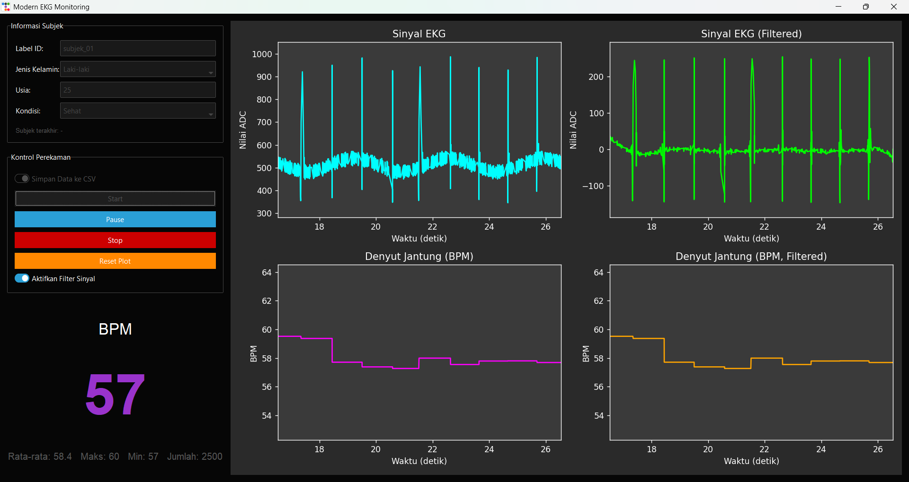

# EKG-OPSI

## Tabel Referensi Denyut Jantung Normal (BPM)

| Kelompok Usia | Jenis Kelamin | Rentang Denyut Jantung Normal (BPM) | Referensi Ilmiah / Sumber |
| :--- | :--- | :--- | :--- |
| **Bayi Baru Lahir** (0–1 bulan) | Gabungan | 100 – 205 | **PALS Guidelines (2020)** - American Heart Association |
| **Bayi** (1–12 bulan) | Gabungan | 100 – 190 | **PALS Guidelines (2020)** - American Heart Association |
| **Balita** (1–3 tahun) | Gabungan | 98 – 140 | **Fleming, S., et al. (2011), *The Lancet*** - Studi besar tentang rentang tanda vital pada anak. |
| **Prasekolah** (3–5 tahun) | Gabungan | 80 – 120 | **Fleming, S., et al. (2011), *The Lancet*** |
| **Usia Sekolah** (6–12 tahun) | Gabungan | 75 – 118 | **Fleming, S., et al. (2011), *The Lancet*** |
| **Remaja** (13–17 tahun) | Gabungan | 60 – 100 | **National Institutes of Health (NIH), U.S.** - Panduan tanda vital umum. |
| **Dewasa** (18+ tahun) | Pria & Wanita | 60 – 100 | **American Heart Association (AHA)** - Definisi standar denyut jantung istirahat normal. |
| **Dewasa** (18+ tahun) | Rata-rata Pria | 60 – 80 | **d'Ascenzi, F., et al. (2019), *Journal of the American Heart Association*** - Analisis perbedaan RHR berdasarkan jenis kelamin. |
| **Dewasa** (18+ tahun) | Rata-rata Wanita | 62 – 82 | **d'Ascenzi, F., et al. (2019), *Journal of the American Heart Association*** - Wanita cenderung memiliki RHR sedikit lebih tinggi. |
| **Atlet Dewasa** | Pria & Wanita | 40 – 60 | **American Heart Association (AHA)** - Menjelaskan efek latihan ketahanan pada jantung. |

## \#\# Tabel Panduan Parameter EKG 📋

Tabel ini merangkum ciri-ciri khas dari sinyal EKG untuk kondisi normal dan beberapa jenis aritmia yang umum.

| Kondisi Jantung | Irama (Rhythm) | Denyut Jantung (BPM) | Interval PR (detik) | Komp. QRS (detik) | Ciri Khas Sinyal / Catatan |
| :--- | :--- | :--- | :--- | :--- | :--- |
| **Irama Sinus Normal** | **Reguler** | 60 - 100 | 0.12 - 0.20 | \< 0.12 (Sempit) | Kondisi **sehat**. Setiap kompleks QRS didahului oleh satu gelombang P yang normal. Semua interval berada dalam rentang normal. |
| **Bradikardia Sinus** | Reguler | \< 60 | 0.12 - 0.20 | \< 0.12 | Sama seperti irama normal, tetapi **lebih lambat**. Umum pada atlet atau saat tidur. |
| **Takikardia Sinus** | Reguler | \> 100 | 0.12 - 0.20 | \< 0.12 | Sama seperti irama normal, tetapi **lebih cepat**. Umum saat olahraga, stres, atau demam. |
| **Fibrilasi Atrium (AFib)** | **Irreguler** (Tidak Teratur) | Variabel (60-180) | Tidak Terukur | Biasanya \< 0.12 | **Tidak ada gelombang P yang jelas**, digantikan oleh getaran acak (garis dasar bergelombang). Interval R-R sangat tidak teratur. |
| **Flutter Atrium** | Biasanya Reguler | Variabel | Tidak Terukur | Biasanya \< 0.12 | **Tidak ada gelombang P**, digantikan oleh gelombang "F" yang khas berbentuk seperti **gigi gergaji (sawtooth)**. |
| **Takikardia Ventrikel (V-Tach)** | Biasanya Reguler | 100 - 250 | Tidak Terukur | **\> 0.12 (Lebar)** | Irama cepat yang berasal dari ventrikel. Kompleks **QRS terlihat lebar dan aneh**. Ini adalah kondisi darurat medis. |
| **Kontraksi Ventrikel Prematur (PVC)** | Irreguler | Sesuai Irama Dasar | Sesuai Irama Dasar | **\> 0.12 (Lebar)** | Muncul satu **denyut aneh yang datang lebih awal**, dengan kompleks QRS yang lebar dan berbeda dari denyut normal di sekitarnya. |
| **Infark Miokard (Serangan Jantung)** | Bisa Reguler/Irreguler | Variabel | Variabel | Variabel | Ciri utamanya bukan pada irama, melainkan pada bentuk sinyal: **elevasi atau depresi segmen ST**, atau inversi gelombang T. |
